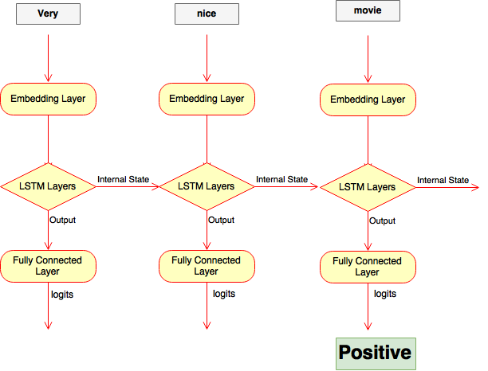

# Classification with an RNN (recurrent neural network)

---

Using an RNN allow us to use the information about the "sequence" for the input words and is more accurate. 

The example data for the current setup is for sentiment. Sentiment analysis is basicly classification with two classes. The model can easily be extended to classify any number of classes.

The example is trained over dataset of movie reviews with labels.

The embedding layer is used for more efficient representation for our input data than one-hot encoded vectors. The embedding can be pre-trained with word2vec for even better results. But it's good enough to just have an embedding layer and let the network learn the embedding table on it's own for the example data.

From the embedding layer, the new representations will be passed to LSTM cells. These will add recurrent connections to the network so we can include information about the sequence of words in the data.

Finally, the LSTM cells will go to a fully connected output layer.

All outputs from FC layer are ignored except for the very last one.
